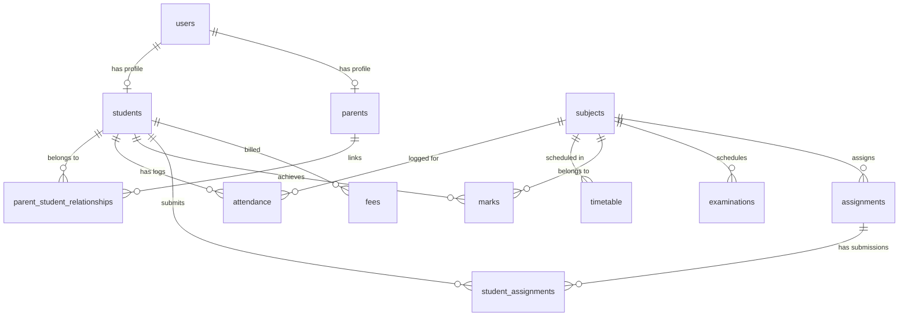

# EduMitra Database Schema & Authorization Model

This document outlines the entity-relationship specifications, table columns, constraints, and security authorization rules enforced across the database layer.

---

## Entity Relationship Overview

---

## Data Specifications & Table Details

### 1. `users`
- `id` (VARCHAR 50, PK): Unique user ID (e.g., `USR_STU_001`, `USR_PAR_001`, `USR_ADMIN`).
- `email` (VARCHAR 100, UNIQUE, INDEX): Login email address.
- `password_hash` (VARCHAR 255): SHA256 hashed password string.
- `full_name` (VARCHAR 100): User display name.
- `role` (VARCHAR 20): `STUDENT`, `PARENT`, or `ADMIN`.
- `created_at` / `updated_at`: Timestamp metadata.

### 2. `students`
- `id` (VARCHAR 50, PK): Student identifier (e.g., `STU001`).
- `user_id` (VARCHAR 50, FK `users.id`, UNIQUE): Linked user account.
- `roll_number` (VARCHAR 50, UNIQUE, INDEX): Academic roll number.
- `department` (VARCHAR 100): Department name (e.g., `Computer Science`, `Data Science`).
- `semester` (INTEGER): Current semester number (e.g., `4`).
- `section` (VARCHAR 10): Section code (`A`, `B`).
- `cgpa` (FLOAT): Current Cumulative Grade Point Average.
- `target_cgpa` (FLOAT): Desired target CGPA.

### 3. `parents`
- `id` (VARCHAR 50, PK): Parent identifier (e.g., `PAR001`).
- `user_id` (VARCHAR 50, FK `users.id`, UNIQUE): Linked user account.
- `phone_number` (VARCHAR 20): Contact phone number.

### 4. `parent_student_relationships`
- `id` (INTEGER, PK): Primary key ID.
- `parent_id` (VARCHAR 50, FK `parents.id`): Parent identifier.
- `student_id` (VARCHAR 50, FK `students.id`): Authorized child identifier.
- `relationship_type` (VARCHAR 50): `FATHER`, `MOTHER`, or `GUARDIAN`.
- `is_active` (BOOLEAN): Active status indicator.

---

## Security & Authorization Rules

> [!IMPORTANT]
> **Tenant Data Isolation**:
> 1. **Students**: Can strictly only access records where `student_id == student.id`. Attempting to access another `student_id` raises HTTP `403 Forbidden`.
> 2. **Parents**: Can strictly only access records of `student_id` where an active entry in `parent_student_relationships` links the parent to that `student_id`. Attempting to access any unauthorized `student_id` raises HTTP `403 Forbidden`.
> 3. **Admins**: Granted full access to query any student profile and dataset.
